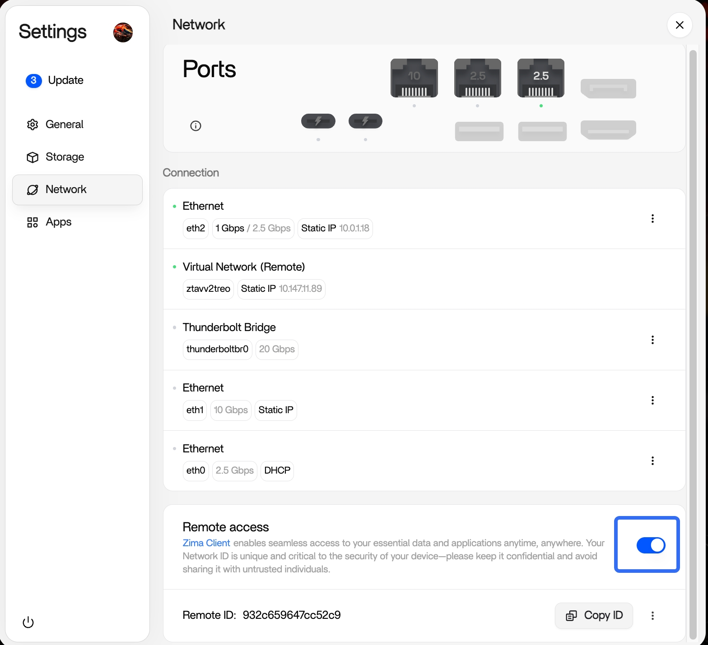
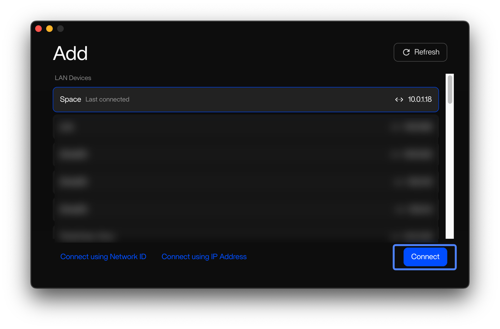
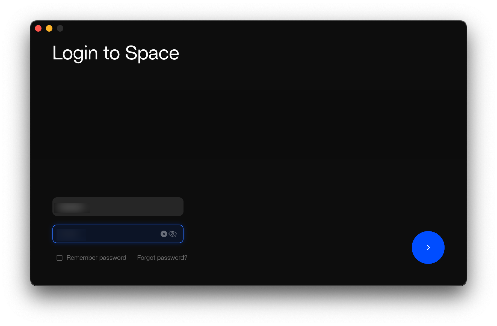
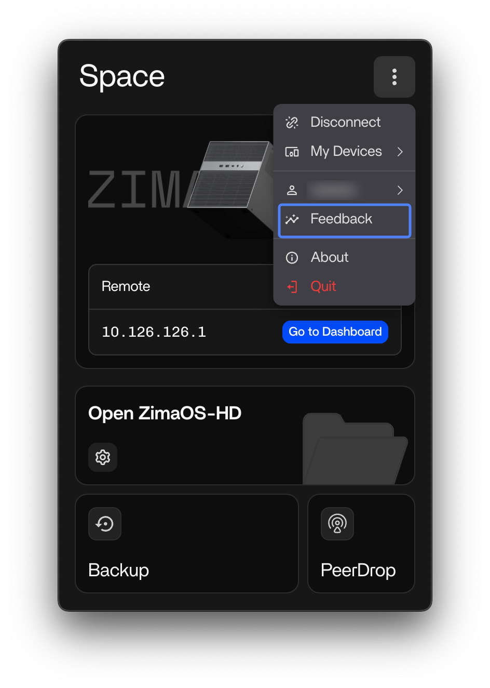
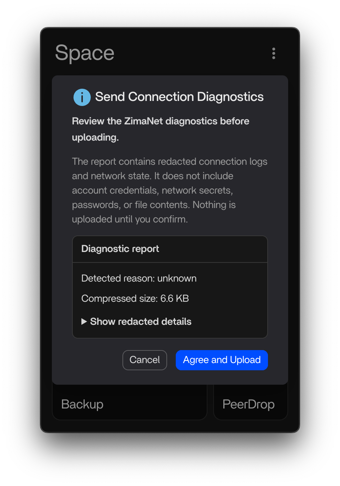
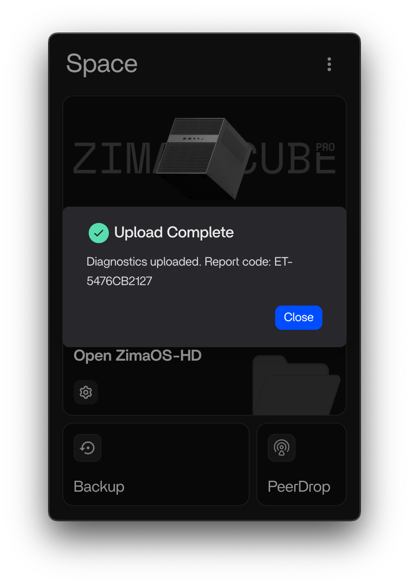
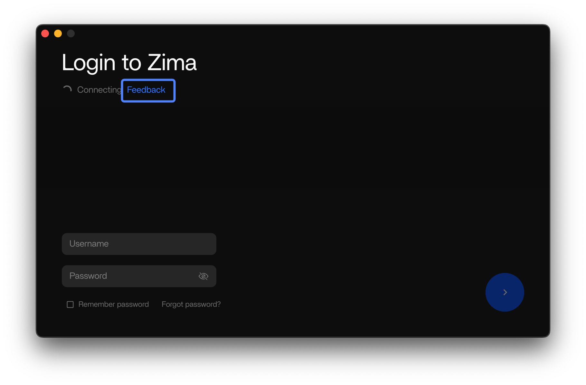
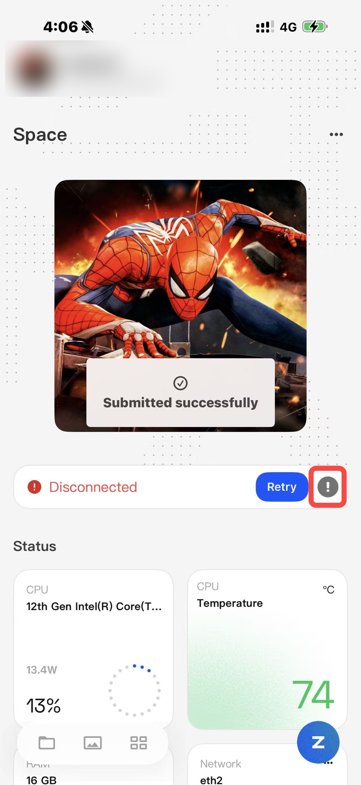

# ZimaNet Remote Access Testing Guide

Zima Client and ZimaOS establish an **encrypted peer-to-peer** channel between your device and the home server. Your data travels directly from one to the other. **No third-party server sits in the middle**, and no one can read what passes through.

This new solution is designed to provide faster and more stable remote connections across Windows, macOS, iOS, and Android. Your feedback will help us identify connection issues across different devices and network environments. Thanks a lot!

---

**Connecting to ZimaOS Remotely**

> 1. First connection (at home)
> Connect your client device to ZimaOS while both devices are on the same local network. The client will recognize this device for future remote connections.
>
> 2. Remote connection (outside your home or another network)
> Switch your client device to another Wi-Fi network or mobile data. Open Zima Client again, and it will automatically detect your ZimaOS device.
>
> 3. Manual connection (optional)
> If this client has never connected to this device before, use Remote ID to add it manually.

---

## Before You Start

Please make sure your test environment meets the following requirements:

- **ZimaOS:** Version 1.7.0 or later (1.7.1)
- **macOS:** macOS 15 or later (**Note:** If you are using macOS 27, please update to **macOS 27 Beta 5** testing.)
- **Windows:** Windows 10 or later
- **iOS:** iOS 16 or later
- **Android:** Android 11 or later

### Testing Process

1. Enable Remote access in ZimaOS
2. Connect using the Zima Client
3. Submit the test report

Whether the test succeeds or fails, please submit a report. Your feedback is very important to us and helps us continue improving the experience.

---

# Step 1: Enable Remote Access

Go to: **Settings → Network → Remote access**

Turn it on. (Remote ID is only needed for manual connection when the device has not been connected before.)

---

# Step 2: Test the Remote Connection

### Choose the platform you want to test.

| Platform | Download |
| --- | --- |
| iOS | [TestFlight](https://testflight.apple.com/join/3Mvt8H43) |
| Android | [Zima-2.3.2-android.apk](https://github.com/IceWhaleTech/ZimaClient/releases/download/v2.3.2/Zima-2.3.2-android.apk) |
| macOS (arm64) | [Zima-2.3.2.109-mac-arm64.pkg](https://github.com/IceWhaleTech/ZimaClient/releases/download/v2.3.2/Zima-2.3.2.109-mac-arm64.pkg) |
| Windows (x64) | [Zima-2.3.2.59-win-x64.exe](https://github.com/IceWhaleTech/ZimaClient/releases/download/v2.3.2/Zima-2.3.2.59-win-x64.exe) |

---

## iOS / Android APP

1. First, connect to your ZimaOS device while on the same local network.
2. Switch your device to another Wi-Fi or mobile network.
3. Open Zima Client again. Your device should be detected and connected automatically.

### Submit the Test Report

Once connected, please click the **gray exclamation mark (!) next to the IP address** and upload the logs to us. Thank you very much for your help!

---

## macOS / Windows Client

**Important:**

1. Please run the Zima Client as Administrator.
2. Please uninstall the old Zima Client before installing the new one.

### Connect

1. First, connect to your ZimaOS device while both devices are on the same local network.
2. Switch your client device to another Wi-Fi network or mobile data.
3. Open Zima Client again. Your ZimaOS device should be detected automatically.

### Submit the Test Report

After connecting successfully:

1. Click the **⋮** menu in Zima Client.
2. Select **Feedback**.
3. Submit the report.
4. Wait until **"Upload Complete"** appears.

This helps us analyze connection performance and troubleshoot issues. Thanks a lot!

---

# If the Connection Fails

If you're unable to connect, please email us at [caitianwei@icewhale.org](mailto:caitianwei@icewhale.org) and include the following information:

- Your **country or region**
- Your **network environment**
- An **error screenshot from the client**

**macOS / Windows / iOS / Android:** You can also click **Feedback** in the client to send us a report.

---

Thank you very much for your testing and support. Your feedback helps us continuously improve ZimaNet and bring the community a faster, more stable remote access experience!

Best regards,

IceWhale Team
